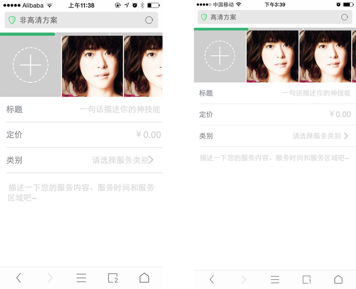
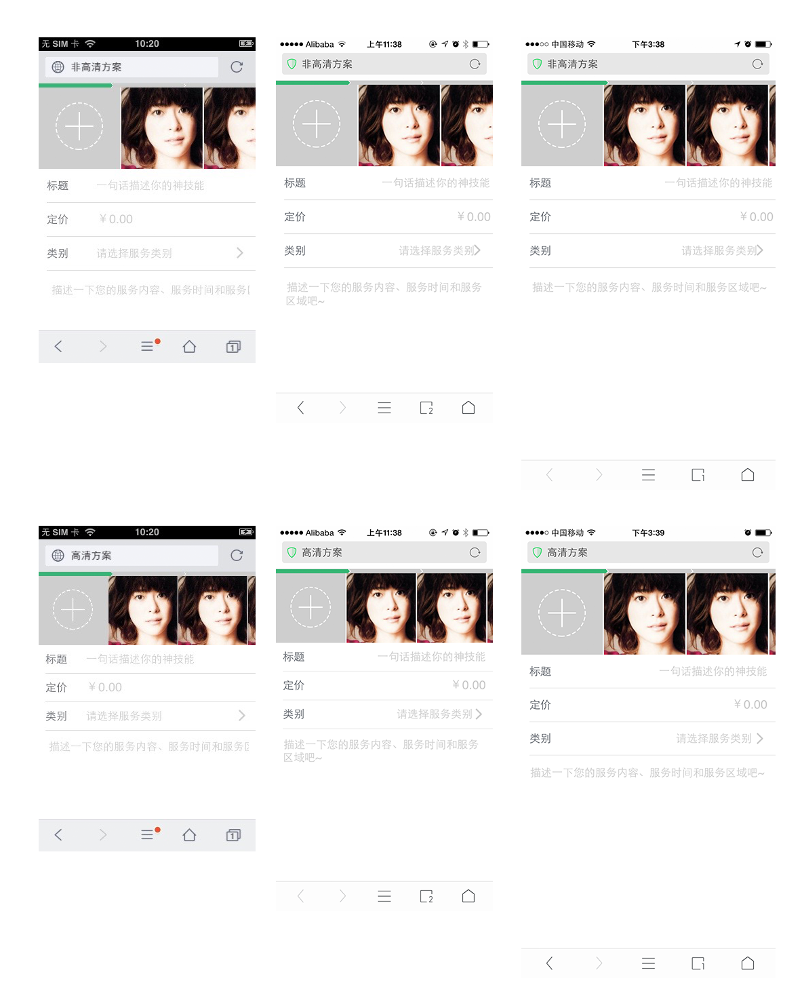

# 移动端高清、多屏适配方案
原文链接:[http://div.io/topic/1092](http://div.io/topic/1092)
---

### 背景
1. 开发移动端H5页面
2. 面对不同分辨率的手机
3. 面对不同屏幕尺寸的手机

---

## 视觉稿
在前端开发之前，视觉MM会给我们一个psd文件，称之为`视觉稿`。  
对于移动端开发而言，为了做到页面高清的效果，视觉稿的规范往往会遵循以下两点：  
1. 首先，选取一款手机的屏幕宽高作为基准(以前是iphone4的320×480，现在更多的是iphone6的375×667)。
2. 对于retina屏幕(如: dpr=2)，为了达到高清效果，视觉稿的画布大小会是基准的2倍，也就是说像素点个数是原来的4倍（对iphone6而言：原先的375×667，就会变成750×1334）。
问题：  
1. 对于dpr=2的手机，为什么画布大小×2，就可以解决高清问题？
2. 对于2倍大小的视觉稿，在具体的css编码中如何还原每一个区块的真实宽高(也就是布局问题)?
带着问题，往下看...  

---

## 一些概念
在进行具体的分析之前，首先得知道下面这些关键性基本概念(术语)。  .
**物理像素(physical pixel)**  
一个物理像素是显示器(手机屏幕)上最小的物理显示单元，在操作系统的调度下，每一个设备像素都有自己的颜色值和亮度值。  
**设备独立像素(density-independent pixel)**  
设备独立像素(也叫密度无关像素)，可以认为是计算机坐标系统中得一个点，这个点代表一个可以由程序使用的虚拟像素(比如: css像素)，然后由相关系统转换为物理像素。  
所以说，物理像素和设备独立像素之间存在着一定的`对应关系`，这就是接下来要说的`设备像素比`。  
**设备像素比(device pixel ratio )**  
设备像素比(简称dpr)定义了物理像素和设备独立像素的对应关系，它的值可以按如下的公式的得到：  
```
设备像素比 = 物理像素 / 设备独立像素 // 在某一方向上，x方向或者y方向
```
在javascript中，可以通过`window.devicePixelRatio`获取到当前设备的dpr。  

在css中，可以通过`-webkit-device-pixel-ratio`，`-webkit-min-device-pixel-ratio`和 `-webkit-max-device-pixel-ratio`进行媒体查询，对不同dpr的设备，做一些样式适配(这里只针对webkit内核的浏览器和webview)。  

---

综合上面几个概念，一起举例说明下：  
以iphone6为例：  
1. 设备宽高为375×667，可以理解为设备独立像素(或css像素)。
2. dpr为2，根据上面的计算公式，其物理像素就应该×2，为750×1334。
用一张图来表现，就是这样：  

上图中可以看出，对于这样的css样式：  
```css
width: 2px;
height: 2px;
```
在不同的屏幕上(普通屏幕 vs retina屏幕)，css像素所呈现的大小(物理尺寸)是一致的，不同的是1个css像素所对应的物理像素个数是不一致的。  
在普通屏幕下，1个css像素 对应 1个物理像素(1:1)。  
在retina 屏幕下，1个css像素对应 4个物理像素(1:4)。  

---

**位图像素**  
一个位图像素是栅格图像(如：png, jpg, gif等)最小的数据单元。每一个位图像素都包含着一些自身的显示信息(如：显示位置，颜色值，透明度等)。  
谈到这里，就得说一下，retina下图片的展示情况？

---
谈到这里，就得说一下，retina下图片的展示情况？

理论上，1个位图像素对应于1个物理像素，图片才能得到完美清晰的展示。

在普通屏幕下是没有问题的，但是在retina屏幕下就会出现位图像素点不够，从而导致图片模糊的情况。

用一张图来表示：

如上图：对于dpr=2的retina屏幕而言，1个位图像素对应于4个物理像素，由于单个位图像素不可以再进一步分割，所以只能就近取色，从而导致图片模糊(注意上述的几个颜色值)。

所以，对于图片高清问题，比较好的方案就是`两倍图片`(@2x)。

如：200×300(css pixel)img标签，就需要提供400×600的图片。

如此一来，位图像素点个数就是原来的`4`倍，在retina屏幕下，`位图像素点个数`就可以跟`物理像素点个数`形成 `1 : 1`的比例，图片自然就清晰了(这也解释了之前留下的一个问题，为啥视觉稿的画布大小要`×2`？)。

---
这里就还有另一个问题，如果普通屏幕下，也用了两倍图片，会怎样呢？

很明显，在普通屏幕下，200×300(css pixel)img标签，所对应的物理像素个数就是`200×300`个，而两倍图片的位图像素个数则是`200×300*4`，所以就出现一个物理像素点对应4个位图像素点，所以它的取色也只能通过一定的算法(显示结果就是一张只有原图像素总数四分之一，我们称这个过程叫做`downsampling`)，肉眼看上去虽然图片不会模糊，但是会觉得图片缺少一些锐利度，或者是有点色差(但还是可以接受的)。

用一张图片来表示：


-----------------------
针对上面的两个问题，我做了一个demo(内网访问)狂戳这里。

retina image diff

demo中，100×100的图片，分别放在100×100，50×50，25×25的img容器中，在retina屏幕下的显示效果。

条形图，通过放大镜其实可以看出边界像素点取值的不同：

图1，就近取色，色值介于红白之间，偏淡，图片看上去会模糊(可以理解为图片拉伸)。
图2，没有就近取色，色值要么是红，要么是白，图片看上去很清晰。
图3，就近取色，色值介于红白之间，偏重，图片看上去有色差，缺少锐利度(可以理解为图片挤压)。
爱字图，可以通过看文字"爱"来区分图片模糊还是清晰。
---
## 几个问题
这里说一下，移动端H5开发，在不同分辨率，不同屏幕手机下会遇到的几个经典问题。

**retina下，图片高清问题**

这个问题上面已经介绍过解决方案了：两倍图片(@2x)，然后图片容器缩小50%。

如：图片大小，400×600;

1.img标签
```
width: 200px;
height: 300px;
```
2.背景图片
```
width: 200px;
height: 300px;
background-image: url(image@2x.jpg);
background-size: 200px 300px; // 或者: background-size: contain;
```
这样的缺点，很明显，普通屏幕下：

同样下载了@2x的图片，造成资源浪费。
图片由于downsampling，会失去了一些锐利度(或是色差)。
所以最好的解决办法是：不同的dpr下，加载不同的尺寸的图片。

不管是通过css媒体查询，还是通过javascript条件判断都是可以的。
---
那么问题来了，这样的话，不就是要准备两套图片了嘛？(@1x 和@2x)

我想，做的好的公司，都会有这么一个图片服务器，通过url获取参数，然后可以控制图片质量，也可以将图片裁剪成不同的尺寸。

所以我们只需上传大图(@2x)，其余小图都交给图片服务器处理，我们只要负责拼接url即可。

如，这样一张原图：
```
https://img.alicdn.com/tps/TB1AGMmIpXXXXafXpXXXXXXXXXX.jpg // 原图
```
可以类似这样，进行图片裁剪：
```
// 200×200
https://img.alicdn.com/tps/TB1AGMmIpXXXXafXpXXXXXXXXXX.jpg_200x200.jpg

// 100×100
https://img.alicdn.com/tps/TB1AGMmIpXXXXafXpXXXXXXXXXX.jpg_100x100.jpg
```
(ps: 当然裁剪只是对原图的等比裁剪，得保证图片的清晰嘛~)
---
**retina下，border: 1px问题**  

这大概是设计师最敏感，最关心的问题了。

首先得说一下，为什么存在retina下，border: 1px这一说？

我们正常的写css，像这样border: 1px;，在retina屏幕下，会有什么问题吗？

先来，来看看下面的图：

上面两张图分别是在`iphone3gs(dpr=1)和iphone5(dpr=2)`下面的测试效果，对比来看，对于1px的border的展示，它们是一致的，并无区别。

那么retina显示屏的优势在哪里，设计师为何觉得`高清屏`下(右图)这个线条`粗`呢？明明和左右一样的~

还是通过一张图来解释：

上图中，对于一条1px宽的直线，它们在屏幕上的物理尺寸(灰色区域)的确是相同的，不同的其实是屏幕上最小的物理显示单元，即物理像素，所以对于一条直线，iphone5它能显示的最小宽度其实是图中的红线圈出来的灰色区域，用css来表示，理论上说是0.5px。

**所以，设计师想要的retina下`border: 1px;`，其实就是1物理像素宽，对于css而言，可以认为是`border: 0.5px;`，这是retina下(dpr=2)下能显示的最小单位。**

然而，无奈并不是所有手机浏览器都能识别`border: 0.5px;`，ios7以下，android等其他系统里，0.5px会被当成为0px处理，那么如何实现这`0.5px`呢？

最简单的一个做法就是这样(`元素scale`)：
```
.scale{
    position: relative;
}
.scale:after{
    content:"";
    position: absolute;
    bottom:0px;
    left:0px;
    right:0px;
    border-bottom:1px solid #ddd;
    -webkit-transform:scaleY(.5);
    -webkit-transform-origin:0 0;
}
```
我们照常写border-bottom: 1px solid #ddd;，然后通过transform: scaleY(.5)缩小0.5倍来达到0.5px的效果，但是这样hack实在是不够通用(如：圆角等)，写起来也麻烦。

当然还有其他好多hack方法，网上都可以搜索到，但是各有利弊，这里比较推荐的还是页面scale的方案，是比较通用的，几乎满足所有场景。

对于iphone5(dpr=2)，添加如下的meta标签，设置viewport(scale 0.5)：
```
<meta name="viewport" content="width=640,initial-scale=0.5,maximum-scale=0.5, minimum-scale=0.5,user-scalable=no">
```
这样，页面中的所有的border: 1px都将缩小0.5，从而达到border: 0.5px;的效果。

有人担心页面scale后会影响性能，@妙净同学做过性能测试，见这里(内网地址)。

看一下实现后的效果图对比(右图为优化过的)：


---

然而，页面scale，必然会带来一些问题：

字体大小会被缩放
页面布局会被缩放(如: div的宽高等)
这两个问题后面讲到...

---
多屏适配布局问题
移动端布局，为了适配各种大屏手机，目前最好用的方案莫过于使用相对单位rem。

基于rem的原理，我们要做的就是: 针对不同手机屏幕尺寸和dpr动态的改变根节点html的font-size大小(基准值)。

这里我们提取了一个公式(rem表示基准值)

rem = document.documentElement.clientWidth * dpr / 10
说明：

乘以dpr，是因为页面有可能为了实现1px border页面会缩放(scale) 1/dpr 倍(如果没有，dpr=1),。
除以10，是为了取整，方便计算(理论上可以是任何值)
所以就像下面这样，html的font-size可能会：

iphone3gs: 320px / 10 = 32px

iphone4/5: 320px * 2 / 10 = 64px

iphone6: 375px * 2 / 10 = 75px

对于动态改变根节点html的font-size，我们可以通过css做，也可以通过javascript做。

css方式，可以通过设备宽度来媒体查询来改变html的font-size：

html{font-size: 32px;}
//iphone 6 
@media (min-device-width : 375px) {
   html{font-size: 64px;}
}
// iphone6 plus 
@media (min-device-width : 414px) {
    html{font-size: 75px;}
}
*/
缺点：通过设备宽度范围区间这样的媒体查询来动态改变rem基准值，其实不够精确，比如：宽度为360px 和 宽度为320px的手机，因为屏宽在同一范围区间内(<375px)，所以会被同等对待(rem基准值相同)，而事实上他们的屏幕宽度并不相等，它们的布局也应该有所不同。最终，结论就是：这样的做法，没有做到足够的精确，但是够用。

javascript方式，通过上面的公式，计算出基准值rem，然后写入样式，大概如下(代码参考自kimi的m-base模块)

var dpr, rem, scale;
var docEl = document.documentElement;
var fontEl = document.createElement('style');
var metaEl = document.querySelector('meta[name="viewport"]');

dpr = window.devicePixelRatio || 1;
rem = docEl.clientWidth * dpr / 10;
scale = 1 / dpr;


// 设置viewport，进行缩放，达到高清效果
metaEl.setAttribute('content', 'width=' + dpr * docEl.clientWidth + ',initial-scale=' + scale + ',maximum-scale=' + scale + ', minimum-scale=' + scale + ',user-scalable=no');

// 设置data-dpr属性，留作的css hack之用
docEl.setAttribute('data-dpr', dpr);

// 动态写入样式
docEl.firstElementChild.appendChild(fontEl);
fontEl.innerHTML = 'html{font-size:' + rem + 'px!important;}';

// 给js调用的，某一dpr下rem和px之间的转换函数
window.rem2px = function(v) {
v = parseFloat(v);
return v * rem;
};
window.px2rem = function(v) {
    v = parseFloat(v);
    return v / rem;
};

window.dpr = dpr;
window.rem = rem;
这种方式，可以精确地算出不同屏幕所应有的rem基准值，缺点就是要加载这么一段js代码，但个人觉得是这是目前最好的方案了。

因为这个方案同时解决了三个问题：

border: 1px问题
图片高清问题
屏幕适配布局问题

---
说到布局，自然就得回答一下最初的留下的那个问题：如何在css编码中还原视觉稿的真实宽高？

前提条件：

拿到的是一个针对iphone6的高清视觉稿 750×1334
采用上述的高清方案(js代码)。
如果有一个区块，在psd文件中量出：宽高750×300px的div，那么如何转换成rem单位呢？

公式如下：

rem = px / 基准值;
对于一个iphone6的视觉稿，它的基准值就是75(之前有提到);

所以，在确定了视觉稿(即确定了基准值)后，通常我们会用less写一个mixin，像这样：

// 例如: .px2rem(height, 80);
.px2rem(@name, @px){
    @{name}: @px / 75 * 1rem;
}
所以，对于宽高750×300px的div，我们用less就这样写：

.px2rem(width, 750);
.px2rem(height, 300);
转换成html，就是这样：

width: 10rem; // -> 750px
height: 4rem; // -> 300px
最后因为dpr为2，页面scale了0.5，所以在手机屏幕上显示的真实宽高应该是375×150px，就刚刚好。

倘若页面并没有scale 0.5，我们的代码就得这样：

.px2rem(width, 375);
.px2rem(height, 150);
这样的宽高，我们往往是这样得来的：

将750×1334的视觉稿转成375×667的大小后，再去量这个区块的大小(感觉好傻)。
在750×1334量得区块宽高是750×300px后，再口算除以2(感觉好麻烦)。
---
最后给出一张没有布局适配(上图)和用rem布局适配(下图)的对比图：

(上面的手机分别是：iphone3gs, iphone5, iphone6)

很明显可以看出，rem适配的各个区块的宽高都会随着手机屏宽而改变，最最明显的可以看一下图片列表那部分，最后一张图视觉稿要求只出现一点点，rem布局在任何屏幕下都显示的很好。
---
字体大小问题
既然上面的方案会使得页面缩放(scale)，对于页面区块的宽高，我们可以依赖高清视觉稿，因为视觉稿本来就×2了，我们直接量就可以了，那么对于字体该如何处理呢？

对于字体缩放问题，设计师原本的要求是这样的：任何手机屏幕上字体大小都要统一，所以我们针对不同的分辨率(dpr不同)，会做如下处理：

font-size: 16px;
[data-dpr="2"] input {
  font-size: 32px;
}
(注意，字体不可以用rem，误差太大了，且不能满足任何屏幕下字体大小相同)

为了方便，我们也会用less写一个mixin：

.px2px(@name, @px){
    @{name}: round(@px / 2) * 1px;
    [data-dpr="2"] & {
        @{name}: @px * 1px;
    }
    // for mx3
    [data-dpr="2.5"] & {
        @{name}: round(@px * 2.5 / 2) * 1px;
    }
    // for 小米note
    [data-dpr="2.75"] & {
        @{name}: round(@px * 2.75 / 2) * 1px;
    }
    [data-dpr="3"] & {
        @{name}: round(@px / 2 * 3) * 1px
    }
    // for 三星note4
    [data-dpr="4"] & {
        @{name}: @px * 2px;
    }
}
(注意：html的data-dpr属性就是之前js方案里面有提到的，这里就有用处了)

根据经验和测试，还是会出现这些奇奇葩葩的dpr，这里做了统一兼容~

用的时候，就像这样：

.px2px(font-size, 32);
当然对于其他css属性，如果也要求不同dpr下都保持一致的话，也可以这样操作，如：

.px2px(padding, 20);
.px2px(right, 8);
最后
上面对移动端H5高清和多屏适配的一些方案总结，和知识讲解，不对的地方，还请指出来，新浪微博 - Lovesueee。

参考文章
http://www.smashingmagazine.com/2012/08/20/towards-retina-web/
http://www.paintcodeapp.com/news/iphone-6-screens-demystified
http://www.inserthtml.com/2012/09/designing-retina-devices/
http://iconmoon.com/blog2/iphone-6-plus-screen-size/
http://dieulot.net/css-retina-hairline